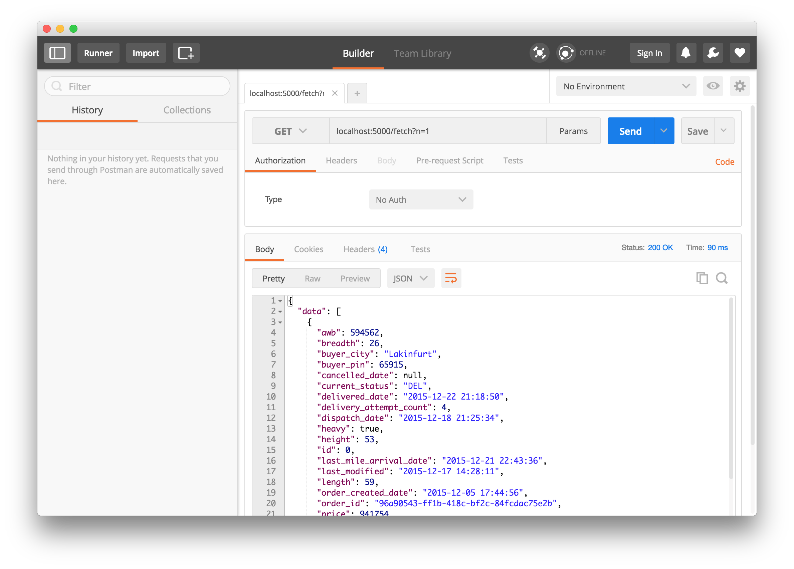
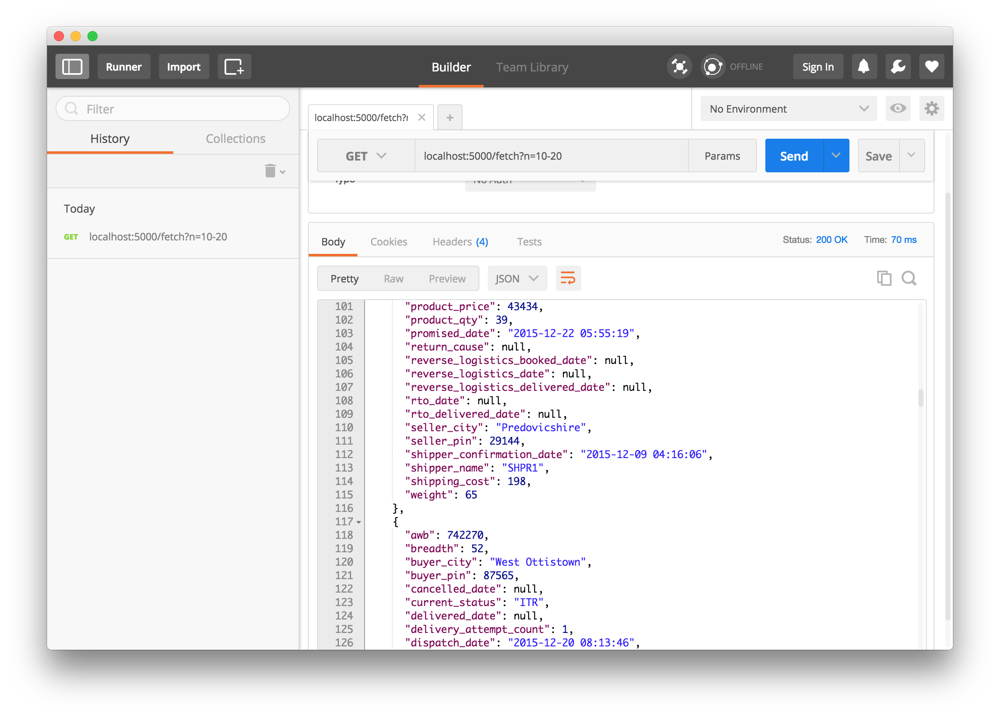
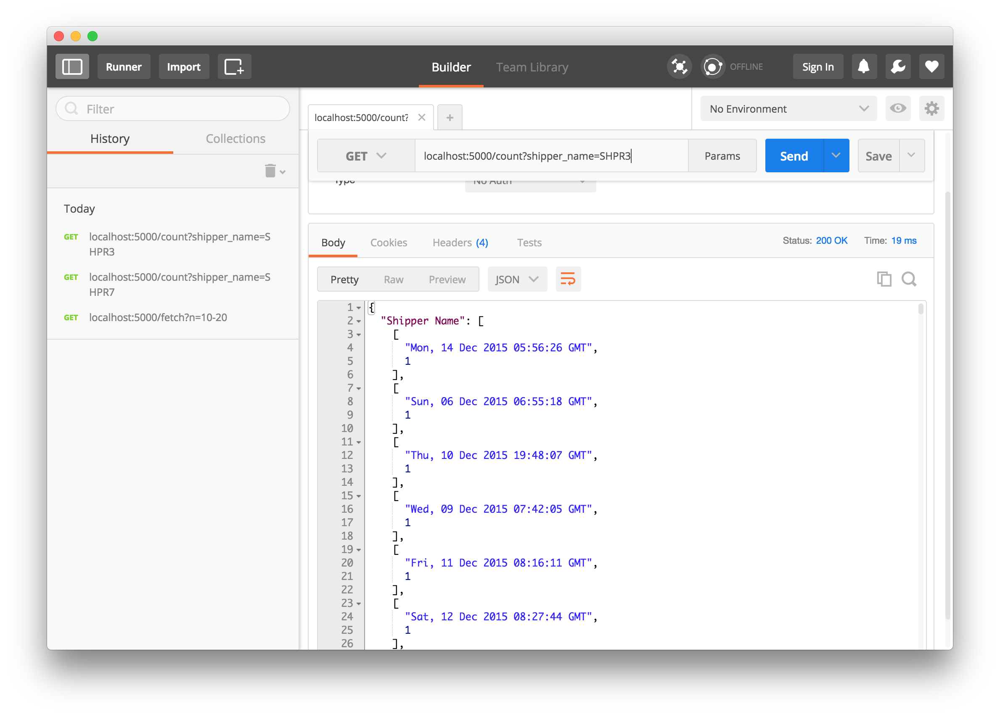
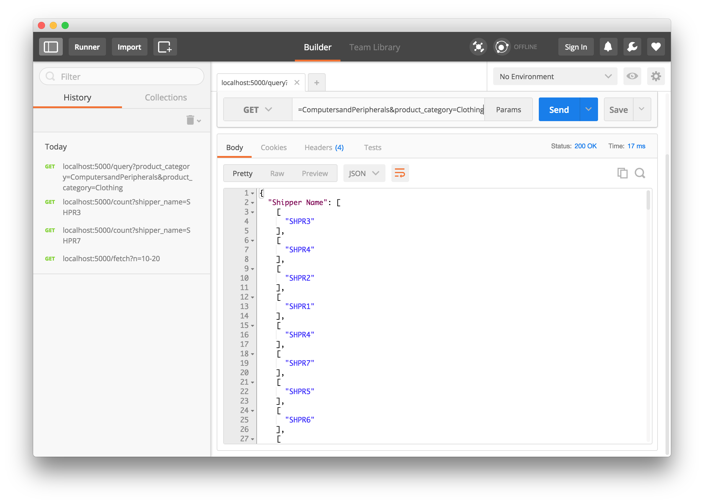

## Documentation

**Supply AI  - data.csv**
----
  Use this API to ingest data.csv to PostgresSQL Database and query using filter parameters like `seller_city`,  `product category` etc. 

#### Uploading CSV

 Go to `localhost:5000/upload/` and use the uploader utility to upload files. The file is stored in `/upload/` directory and only accepts
 `.csv` files.

#### Example Routes

- Upload: [localhost:5000/upload]

- Row by row insertion: [localhost:5000/fetch?n=1] 

- Bulk Insertion : [localhost:5000/fetch?n=80-90]

- Query :
    - [http://localhost:5000/query?order_id=96a90543-ff1b-418c-bf2c-84fcdac75e2b]
    - [http://localhost:5000/query?seller_city=Boyleland&buyer_city=Rolfsontown]
    - [http://localhost:5000/query?seller_city=Boyleland&buyer_city=Rolfsontown&product_category=Furnishing]

- Error Page : [http://localhost:5000/fetch?inavlid=something] 


#### API Routes

##### /fetch

This route fetches `n` rows from CSV and ingests in DB. `n` can be an integer like `785` or a range like `90-100`.

  -  **Method:**
  
  `GET` 

 **Required URL Params** 
   
        Row by Row: `n=<int>`  or  Bulk update: `n = <int>-<int>`


  - **Success Response:**
  
    - **Code:** 200 <br />
    - **Content:** 
   
    ```
    {"data": [
       {
      "awb": 244479,
      "breadth": 42,
      "buyer_city": "New Cedricville",
      "buyer_pin": 2831,
      "cancelled_date": null,
      "current_status": "DEL",
      "delivered_date": "2015-12-17 02:57:42",
      "delivery_attempt_count": 2,
      "dispatch_date": "2015-12-14 01:13:30",
      "heavy": false,
      "height": 29,
      "id": 653,
      "last_mile_arrival_date": "2015-12-16 20:09:08",
      "last_modified": "2015-12-28 00:48:24",
      "length": 42,
      "order_created_date": "2015-12-07 15:36:22",
      "order_id": "80154b88-27d8-4fcf-8cc9-cccf77980951",
      "price": 975040,
      "product_category": "Tablets",
      "product_id": "72e15f4f-ff7d-440c-8566-5fdc930af2db",
      "product_name": "Strontium 8GB MicroSD Memory Card Class 4",
      "product_price": 18306,
      "product_qty": 10,
      "promised_date": "2015-12-22 11:55:26",
      "return_cause": null,
      "reverse_logistics_booked_date": null,
      "reverse_logistics_date": null,
      "reverse_logistics_delivered_date": null,
      "rto_date": null,
      "rto_delivered_date": null,
      "seller_city": "Buckridgemouth",
      "seller_pin": 9775,
      "shipper_confirmation_date": "2015-12-13 13:56:03",
      "shipper_name": "SHPR4",
      "shipping_cost": 46,
      "weight": 21
    }
  ]
}
```
 
* **Error Response:**

  - **Code:** 404 Not Found <br />
  - **Content:** `{'error': 'Not found'}}`

* **Sample Call:**

```
$ curl -i localhost:5000/fetch?n=80-90
HTTP/1.0 200 OK
Content-Type: application/json
Content-Length: 14699
Server: Werkzeug/0.11.11 Python/3.5.2
Date: Fri, 25 Nov 2016 04:03:12 GMT

{
  "data": [...
  ]
  ...
  }
```




* **Notes:**

Zero indexing has been taken care of so rows should start from 1 for the first row. This is a pythonic range so 90-100 would fetch rows from 90 to 99.

---

#### /count

This route counts the number of orders grouped by `order_created_date`, given the `shipper name`.

* **Method:**
  
  `GET` 
  
*  **Required URL Params**

    Row by Row: `shipper_name=<str>`


* **Success Response:**
  
 - **Code:** 200 OK <br />
 - **Content:** 
        
        ```
        {"Shipper Name": [
        [
          "Sat, 05 Dec 2015 05:36:19 GMT",
          1
        ],
        [
          "Sun, 06 Dec 2015 04:50:00 GMT",
          1
        ],
        [
          "Wed, 09 Dec 2015 22:55:46 GMT",
          1
        ],
        ...] ...}
        
* **Error Response:**

 - **Code:** 404 Not Found <br />
 - **Content:** `{'error': 'Not found'}}`

* **Sample Call:**

```
$ curl -i localhost:5000/count?shipper_name=SHPR2
    HTTP/1.0 200 OK
    Content-Type: application/json
    Content-Length: 8086
    Server: Werkzeug/0.11.11 Python/3.5.2
    Date: Fri, 25 Nov 2016 04:28:27 GMT

{
  "data": [...
  ]
  ...
  }

```



---

#### /query

This route queries the DB using parameters and outputs `shipper_name`
    
    - `order_id`
    - `seller_city` 
    - `buyer_city`
    - `product_category`

The parameter can be passed as a single set or multiple comma separated values. 

* **Method:**
  
  `GET` 
  
*  **Required URL Params**

    Any one of them is `required`
    
    - `order_id=<str>`
    - `seller_city=<str>`
    - `buyer_city=<str>`
    - `product_category=<str>`

    To use multiple values, for example:

    - `buyer_city=<str,str,str>`

* **Success Response:**
  
  * **Code:** 200 <br />
  * **Content:** 
    ```
    {
  "Shipper Name": [
    [
      "SHPR3"
    ]
  ]
}
```
 
* **Error Response:**

  * **Code:** 404 Not Found <br />
  * **Content:** `{'error': 'Not found'}}`

* **Sample Call:**
```
$ curl -i localhost:5000/query?seller_city=Boyleland
HTTP/1.0 200 OK
Content-Type: application/json
Content-Length: 54
Server: Werkzeug/0.11.11 Python/3.5.2
Date: Fri, 25 Nov 2016 04:41:51 GMT

{
  "Shipper Name": [
    [
      "SHPR3"
    ]
  ]
}

```

```
$ curl -i localhost:5000/query?order_id=3081f2a7-709a-4fd1-9c35-92bbee0089fe
HTTP/1.0 200 OK
Content-Type: application/json
Content-Length: 54
Server: Werkzeug/0.11.11 Python/3.5.2
Date: Fri, 25 Nov 2016 04:42:35 GMT

{
  "Shipper Name": [
    [
      "SHPR1"
    ]
  ]
}

```
```
$ curl -i localhost:5000/query?product_category=Clothing&buyer_city=North Pamala
[1] 72861
-bash: Pamala: command not found
HTTP/1.0 200 OK
Content-Type: application/json
Content-Length: 2798
Server: Werkzeug/0.11.11 Python/3.5.2
Date: Fri, 25 Nov 2016 04:44:44 GMT

{
  "Shipper Name": [
    [
      "SHPR4"
    ],
    [
      "SHPR6"
    ],
    [
      "SHPR7"
    ],
    [
      "SHPR1"
    ],
    [
      "SHPR7"
    ],
    [
      "SHPR5"
    ],
    [
      "SHPR7"
    ],
```

